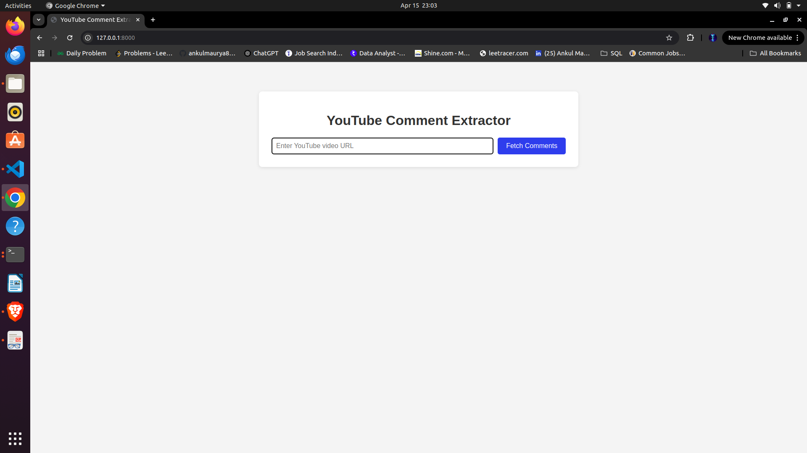
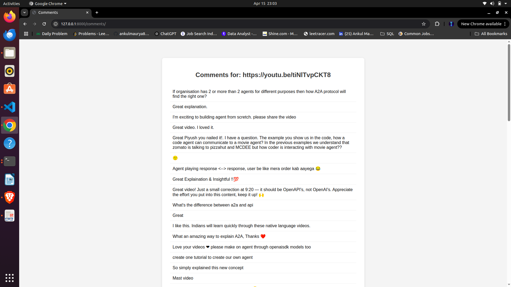

# 📺 YouTube Comment Extractor

The **YouTube Comment Extractor** is a web-based application that allows users to extract comments from any public YouTube video using the YouTube Data API. It provides a simple UI to input a video URL and download the comments in both CSV and JSON formats. The application is built using Python and Flask, and is deployable with Docker for scalable setups.

---

## 📌 Table of Contents

1. [Features](#-features)
2. [Screenshots](#-screenshots)
3. [Input & Output](#-input--output)
4. [Technologies Used](#-technologies-used)
5. [Project Structure](#-project-structure)
6. [Installation Guide](#-installation-guide)
7. [Docker Deployment](#-docker-deployment)
8. [Usage](#-usage)
9. [License](#-license)
10. [Author](#-author)

---

## ✨ Features

- ✅ Extracts all top-level and nested YouTube comments using the video URL
- ✅ Supports comment metadata (author, time, likes, etc.)
- ✅ Download data as **CSV** or **JSON**
- ✅ Simple and clean Flask-based web UI
- ✅ Docker support for easy deployment

---

## 📸 Screenshots


### 🔹 Home Page 


### 🔹 Extracted Comments Displayed


### 🔹 Export Comments Options


---

## 🧪 Input & Output

### 📝 Input:
Paste a public YouTube video URL in the input box, for example:


### 📤 Output:
You’ll get a table of comments with the following fields:

| Comment ID | Author Name | Comment Text         | Published At         | Like Count |
|------------|-------------|----------------------|----------------------|------------|
| abc123     | John Smith  | Great content! 👍     | 2024-06-10 11:30 AM  | 102        |
| def456     | Jane Doe    | Thanks for sharing 🙏 | 2024-06-10 12:00 PM  | 87         |

You can download this as:
- `comments.csv`
- `comments.json`

---

## 🧰 Technologies Used

| Area         | Tools and Frameworks               |
|--------------|------------------------------------|
| Language     | Python 3.8+                        |
| Backend      | Flask                              |
| API          | YouTube Data API v3                |
| Data Export  | Pandas                             |
| UI           | HTML, CSS                          |
| Deployment   | Docker, Docker Compose             |

---

## 📁 Project Structure


---

## ⚙️ Installation Guide

### Prerequisites
- Python 3.8+
- YouTube Data API Key
- Git

### Steps

```bash
# Clone the repository
git clone https://github.com/ankulmaurya88/YouTube-Comment-Extractor.git
cd YouTube-Comment-Extractor

# Create and activate virtual environment (optional but recommended)
python3 -m venv venv
source venv/bin/activate  # On Windows: venv\Scripts\activate

# Install dependencies
pip install -r requirements.txt

# Add your YouTube API Key
cp .env.example .env
# Edit the .env file and add your API key

# Run the Flask app
python app.py
```
---
## ✨ Docker Deployment
---
```bash
# Clone the repo
git clone https://github.com/ankulmaurya88/YouTube-Comment-Extractor.git
cd YouTube-Comment-Extractor

# Add your API key
cp .env.example .env

# Build and run with Docker Compose
docker-compose up --build
```
---
## 🚀 Usage
---
1.Open the app in your browser.

2.Paste a valid YouTube video URL.

3.Click “Extract Comments.”

4.View results in a table format.

5.Download the comments in CSV or JSON format.


## 📄 License
---
-This project is licensed under the MIT License – see the LICENSE file for details.


## 👤 Author
---
Ankul Maurya

GitHub: @ankulmaurya88

LinkedIn: linkedin.com/in/ankulmaurya

---


### Key Updates:
- **Input and Output**: Clearly describes the expected format of the input (YouTube URL) and output (comments table with fields).
- **Technologies Used**: Listed the main tools and frameworks.
- **Project Structure**: Detailed the file structure, making it easier for developers to understand the organization of the codebase.

